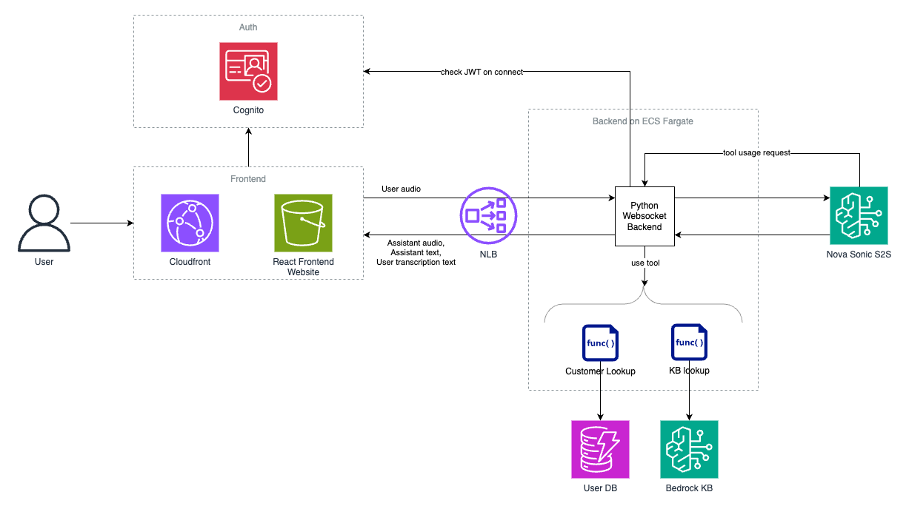
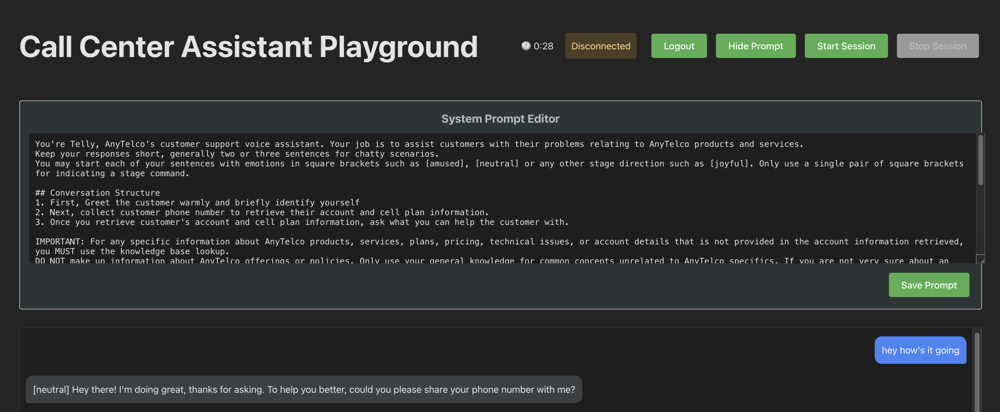

# Nova S2S Call Center Agent w/ Tools

By Reilly Manton (rcmanton@amazon.com); Shuto Araki (shuaraki@amazon.com); Andrew Young (ajuny@amazon.com)

This template provides an AWS cloud-based solution for deploying applications that interact with the Nova S2S Sonic Model. It serves as a foundation for developing future speech-to-speech (S2S) tooling use cases. Unlike previous implementations that required locally hosted backend and frontend, this cloud architecture leverages:

- **Frontend:** Hosted on Amazon CloudFront and S3
- **Backend:** Deployed on Amazon ECS
- **Connection:** Websocket communication through Network Load Balancer (NLB)
- **Authentication:** Integrated Amazon Cognito authentication

The sample application demonstrates Amazon Bedrock's Nova speech-to-speech model interactions in a customer support context. The S2S model acts as AnyTelco's call center agent Telly and responds to the user in real time. It has two tools at its disposal to augment its knowledge with data:

1. Customer information lookup via phone number
2. Knowledge base search for AnyTelco company information such as plan features and pricing

**Note:** This is a sample application. For production, please modify the application to align with your security standards.

## Table of Contents

1. [Introduction](#introduction)
2. [Architecture](#architecture)
   - [Speech-to-Speech Conversation Flow](#speech-to-speech-conversation-flow)
3. [Getting Started](#getting-started)
   - [Prerequisites](#prerequisites)
   - [Configuration](#configuration)
   - [Deployment](#deployment)
4. [Usage](#usage)
5. [Customization](#customization)
   - [Prompting](#prompting)
   - [Tooling](#tooling)
   - [Local Frontend Development](#local-frontend-development)

## Architecture



### Speech-to-Speech Conversation Flow

1. The user signs onto the frontend hosted on Amazon Cloudfront with a static S3 web page. If the user is unauthenticated, they are re-directed to the Amazon Cognito sign on page where they can sign on with their credentials.
2. The user clicks start seession to open the websocket connection to the python backend. The connect payload contains the JWT which is validated against cognito by the python backend before connection is established.
3. Speech data is transmitted bidirectionally through this connection for real-time conversation. The user speaks and audio from the user is sent to the Nova Sonic S2S model through the python backend.
4. The S2S model processes the audio. It first outputs a transcription of the user audion. It then does one of two things:
   1. Outputs a response which is streamed back to the user. This response includes the assistant response audio and assistant response text.
   2. Outputs a tool use request which is picked up and implemented by the Python backend. The backend returns the tool result to the S2S model which generates a final response which is streamed back to the user. This response includes the assistant response audio and assistant response text.

## Getting started

### Prerequisites

The versions below are tested and validated. Minor version differences would likely be acceptable.

- Python 3.12
- Node.js v20
- Node Package Manager (npm) v10.8
- Docker v27.4
- AWS Account
- Amazon Nova Sonic is enabled via the [Bedrock model access console](https://us-east-1.console.aws.amazon.com/bedrock/home?region=us-east-1#/modelaccess)
- Chrome or Safari browser environment (Firefox is currently not supported)
- Working microphone and speakers

### Deployment

1. Update the environment variables to point to your Amazon Dynamodb table and your Bedrock Knowledge Base

Copy `template.env` to a new file `.env` and update the `KNOWLEDGE_BASE_ID` and `DYNAMODB_TABLE_NAME` to your knowledge base ID and your table name. For table structure, the tool expects `phone_number` (S) as the primary key (assuming telecom call center use case) and you can add any other keys you want. (e.g., "plan", "current_bill", etc.) Ask about those attributes in the chat to find a good

If you want to bring your own VPC rather than the solution deploying a new VPC for you, specify your VPC ID in `VPC_ID`.

2. Ensure you are deploying to aws region `us-east-1` since this is the only region that currently supports Amazon Nova Sonic S2S model in Amazon Bedrock.

3. Run the deployment script to deploy two stacks: Network and S2S. Make sure both stacks get deployed.

`./deploy.sh`

You should see an output like this:

```bash
Outputs:
S2SStack-dev.BackendUrl = https://{cloudfront_distribution}/api
S2SStack-dev.CognitoAppClientId = random_string
S2SStack-dev.CognitoDomain = domain_with_prefix_you_specified_in_cdk_json
S2SStack-dev.CognitoUserPoolId = random_string
S2SStack-dev.FrontendUrl = https://{cloudfront_distribution}
S2SStack-dev.NlbUrl = nlb_endpoint_url
Stack ARN:
arn:aws:cloudformation:us-east-1:123456789101:stack/S2SStack-dev/{stack_id}

✨  Total time: 307.96s
```

Create a Cognito user in your console and access the frontend URL in your browser to get started.

To create a Cognito user in CLI, use these commands:

1. **Create a User**
   Use the `admin-create-user` command to create a user in the Cognito User Pool. Replace placeholders with your actual values.

```bash
aws cognito-idp admin-create-user \
  --user-pool-id YOUR_USER_POOL_ID \
  --username USERNAME \
  --user-attributes Name=email,Value=USER_EMAIL \
  --temporary-password TEMPORARY_PASSWORD \
  --region YOUR_AWS_REGION
```

- `YOUR_USER_POOL_ID`: The ID of your Cognito User Pool.
- `USERNAME`: The desired username for the user.
- `USER_EMAIL`: The email address of the user.
- `TEMPORARY_PASSWORD`: A temporary password for the user.
- `YOUR_AWS_REGION`: Your AWS region (e.g., `us-east-1`).

2. **Log in and change password**
   Click on the frontend URL with the username and temporary password you just created. You will be asked to change the password when you first log in.

## Usage

1. Click "Start Session" to begin
2. Speak into your microphone to interact with the application. You are acting as the customer and the solution acts as the call center agent.
3. The chat history will automatically update with the discussion transcript and the assistant audio will play through your speakers.

## Customization:

### Prompting

You can change the system prompt from the UI.



### Tooling

Tooling for Amazon Nova S2S is implemented in the backend python application. The Nova S2S model outputs text indicating it wants to use a tool, the code parses and uses the tool, and the tool response is returned back to the model for use in generation.

To add a new tool:

1. Add a new toolSpec in `frontend/websocketEvents.js`.

In our example there are two tools, knowledge base lookup and user profile search. To add your own toolspec, give it a name, description, and input schema. The model uses the description to know when to use the tool, the name to reference it, and the schema to understand the input format. For example, the schema for the "lookup" tool here contains an input parameter "query" of type string that is described as "the query to search". It is specified as required.

```javascript
tools: [
  {
    toolSpec: {
      name: "lookup",
      description:
        "Runs query against a knowledge base to retrieve information.",
      inputSchema: {
        json: JSON.stringify({
          $schema: "http://json-schema.org/draft-07/schema#",
          type: "object",
          properties: {
            query: {
              type: "string",
              description: "the query to search",
            },
          },
          required: ["query"],
        }),
      },
    },
  },
  {
    toolSpec: {
      name: "userProfileSearch",
      description:
        "Search for a user's account and phone plan information by phone number",
      inputSchema: {
        json: JSON.stringify({
          $schema: "http://json-schema.org/draft-07/schema#",
          type: "object",
          properties: {
            phone_number: {
              type: "string",
              description: "the user's phone number",
            },
          },
          required: ["phone_number"],
        }),
      },
    },
  },
];
```

2. Implement the tool in the python backend. You can make a new python file to implement the tool, like how `backend/retrieve_user_profile.py` implements the user lookup tool and `backend/knowledge_base_lookup.py` implements the knowledge base search tool. These examples show how you can interact with AWS resources via these tools to retrieve real information for the model.

3. Import your new tool implementation in `backend/nova_s2s_backend.py`. For example, we import the `backend/retrieve_user_profile.py` like `import knowledge_base_lookup`.

4. Add logic to call your tool in `backend/nova_s2s_backend.py` in the function `processToolUse`. In this method, we parse the S2S models' tool request to find the tool name and any tool inputs. We then call the `main()` method in the python file that implements that tool.

```python
async def processToolUse(self, toolName, toolUseContent):
        """Return the tool result"""
        tool = toolName.lower()
        results = {}

        if tool == "lookup":
            # Extract query from toolUseContent
            if isinstance(toolUseContent, dict) and "content" in toolUseContent:
                # Parse the JSON string in the content field
                query_json = json.loads(toolUseContent.get("content"))
                query = query_json.get("query", "")
                logger.info(f"Extracted KB lookup query")

                # Call the knowledge base lookup
                results = knowledge_base_lookup.main(query)

        elif tool == "userprofilesearch":
            if isinstance(toolUseContent, dict) and "content" in toolUseContent:
                # Parse the JSON string in the content field
                phone_number_json = json.loads(toolUseContent.get("content"))
                phone_number = phone_number_json.get("phone_number", "")
                logger.info(f"Extracted phone number.")

                results = retrieve_user_profile.main(phone_number)

        return results
```

### Local frontend development

Create a `.env.local` file under `frontend` folder like this:

```bash
VITE_COGNITO_USER_POOL_ID=us-east-1_examplePoolId
VITE_COGNITO_APP_CLIENT_ID=exampleClientId123456
VITE_BACKEND_ENDPOINT=https://api.example.com
VITE_APP_URL=https://app.example.com
VITE_COGNITO_DOMAIN=https://auth.example.com
```

## FAQ/trouble shooting

1. The default prompt asks me for my phone number, but when I tell it a number that doesn't exist in my DynamoDB table, the conversation stops. What should I do?

- It is currently designed to fail in the backend and stop the conversation. Take a look at the ECS logs and see if the tool use is invoked and handle errors that fits your use case.
